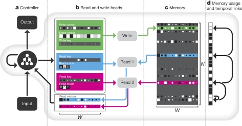
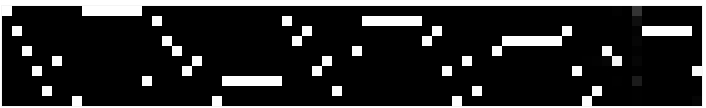
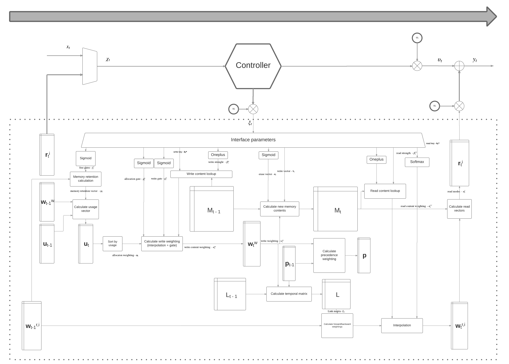

# Differentiable Neural Computer

This is my attempt at implementing Differentiable Neural Computer.

Differentiable Neural Computer (DNC) is the recent creation from Google DeepMind that was published in Nature under the name [Hybrid computing using a neural network with dynamic external memory](https://www.nature.com/nature/journal/v538/n7626/pdf/nature20101.pdf).

It's a recurrent neural network which includes a large number of preset operations that model various memory storage and management mechanisms.

In a way it is modular; DNC embeds another neural network inside it reffered to as the "controller".
Controller can be anything that's differentiable: feedforward network, vanilla RNN, LSTM etc. 
Even if the controller is not a recurrent neural network, the combined system is recurrent.

This implementation includes three tasks from the original paper: copy task, repeat copy task and bAbI question answering task.

TensorFlow 1.2.rc0 and Python 3.6 were used in the implementation.

#### Basic usage instructions

To start the DNC with feedforward controller on the copy task with curriculum learning just run the ``main.py`` file.
It should work out of the box and all the memory operations will be automatically visualized in Tensorboard.

Code is written in a modular way so you can also pass a different controller to the DNC initialization.
LSTM controller is already provided and you can pass it to DNC by just uncommenting it in ``main.py``.

You can also test *just* the LSTM network by running its .run\_session method (you also need to provide the output size when initializing)

---

## Copy and repeat copy tasks

Copy tasks are a sort of sanity check.
They're fast to run and easy to visualize.
The network is presented with a sequence of vectors and tasked to recall them entirely from memory, in the same order.
During the recall phase, no inputs are presented to the network in order to ensure that the network has actually stored all the vectors in memory (unlike in various char-rnn networks).

The sequences show above are sample input and output sequences from the repeat copy task. 
*X* axis represents time steps while *Y* axis represents elements of the vectors.

With repeat copy task it is possible to test DNC's dynamic memory allocation capabilities by making the number of memory slots lower than the total number of things DNC needs to remember. 
DNC would then need to learn to reuse memory locations.
After training DNC on this task, it is possible to visualize write and read weightings and get a glimpse of the internal mechanisms of DNC.

The *X* axis again represents time steps while the *Y* axix represents individual memory locations.
Top image are the write weightings and bottom image are the read weightings.
It is possible to note several things:
* At each step, the writes and reads are focused on a single location
* The focus changes with each step
* The focus of the write weightings corresponds to the focus of the read weightings
* The write focus can never change to an already written location unless the last operation performed on that location was a read operation

It is further possible to analyze the internal state of DNC by plotting memory usage weightings. 
Note that the usage of a certain location drops to zero after the network reads from that location.

Also note that in this specific example the network erroneously *doesn't* update the usage of the first and later the 8th location; resulting in network not using those memory locations for the rest of the sequence.

Additional visualizations can be found at the bottom of this file.

## bAbI synthetic question answering dataset

bAbI is a programatically generated dataset.
It consists of 20 tasks that represent unit tests of different aspects of logical reasoning.
Each task is independent of the other and tests in the simplest way possible one aspect of intended behaviour.

I tested DNC and various LSTM architectures on the same dataset DeepMind used with the same hyperparameters as in the paper (with the exception of batch size).

Although around 4 times slower to train, DNC generally outperforms LSTM networks.

I found that LSTM networks generally have better performance than DeepMind reported in the paper; I've been getting around 4-5% lower error, even with a smaller memory size. I welcome any pull requests or issues explaining why.

Error percentages of my DNC, baseline LSTM compared with DeepMind's mean results:

| Task | DNC | DeepMind's DNC | LSTM 256 | LSTM 512 | DeepMind LSTM 512 |
| -----|---------|------------------- |---|---|---|
| 1. 1 supporting fact | 0.3        | 9.0 &plusmn; 12.6                     | 6.4  | **0.0** | 28.4 &plusmn; 1.5 |
| 2. 2 supporting facts |  32.5       | **32.0 &plusmn; 20.5**                   | 49.5 | 46.2 | 56.0 &plusmn; 1.5 |
| 3. 3 supporting facts |  **36.5**        | 39.6 &plusmn; 16.4                   | 48.4 | 44.2 |  51.3 &plusmn; 1.4 |
| 4. 2 argument rels. |    0.5     |  **0.4 &plusmn; 0.7**                  | 0.7 | 22.6 | 0.8 &plusmn; 0.5 |
| 5. 3 argument rels. |    **1.1**     | 1.5 &plusmn; 1.0                    | 2.6 | 2.5 | 3.2 &plusmn; 0.5 |
| 6. yes/no questions |    **0.9**     | 6.9 &plusmn; 7.5                    | 8.9 | **0.9** | 15.2 &plusmn; 1.5 |
| 7. counting |  **7.0**       | 9.8 &plusmn; 7.0                    | 10.9 | 7.2 | 16.4 &plusmn; 1.4 |
| 8. lists/sets |    **3.4**     | 5.5 &plusmn; 5.9                    | 12.6 | 6.8 | 17.7 &plusmn; 1.2 |
| 9. simple negation |   **0.3**      | 7.7 &plusmn; 8.3                    | 8.3 | **0.3** |  15.4 &plusmn; 1.5|
| 10. indefinite knowl. |   **2.1**      | 9.6 &plusmn; 11.4                    | 24.8 | 18.9 | 28.7 &plusmn; 1.7|
| 11. basic coreference |   0.1      | 3.3 &plusmn; 5.7                    | 1.0 | **0.0** | 12.2 &plusmn; 3.5|
| 12. conjuction | **0.1**        | 5.0 &plusmn; 6.3                    | 1.6 | **0.1** | 5.4 &plusmn; 0.6|
| 13. compound coref. |  **0.0**       | 3.1 &plusmn; 3.6                    | 0.2 | **0.0**  | 7.2 &plusmn; 2.3|
| 14. time reasoning |     14.1    | **11.0 &plusmn; 7.5**                    | 51.3 | 52.1 | 55.9 &plusmn; 1.2|
| 15. basic deduction |    **0.2**     | 27.2 &plusmn; 20.1                    | 41.3 | 45.3 | 47.0 &plusmn; 1.7|
| 16. basic induction |    50.7     | 53.6 &plusmn; 1.9                    | **50.5**  | 54.4 | 53.3 &plusmn; 1.3|
| 17. positional reas. |   **13.4**      | 32.4 &plusmn; 8.0                    | 20.0 | 14.4 |  34.8 &plusmn; 4.1|
| 18. size reasoning |    2.7     | 4.2 &plusmn; 1.8                    | 2.8 | **2.6** | 5.0 &plusmn; 1.4|
| 19. path finding |     94.9    | **64.6 &plusmn; 37.4**                    | 91.9 | 92.7 |  90.9 &plusmn; 1.1|
| 20. agent motiv. |    **0.0**     | **0.0 &plusmn; 0.1**                    | 1.3 | 0.8 | 1.3 &plusmn; 0.4|
| **Mean**        |   **13.0**   | 16.7 &plusmn; 7.6 | 21.8 | 20.6 | 27.3 &plusmn; 0.8 |

Although the 13% DNC error is far from DeepMind's best reported 4.3% error with the same architecture, the cost was noted to be decreasing, albeit very slowly.

Early stopping was used not as an implicit regularization method, but as a "I really can't be bothered to wait another week for the cost to converge" method of finishing the training.

Total DNC training time was around 9 days on NVIDIA GTX 1080.

## Understanding memory operations

Interactions between the controller and memory and somewhat easy to understand.
However, operations that are being computer *in* the memory module are not.

Inspired by this [great DNC implementation](https://github.com/Mostafa-Samir/DNC-tensorflow) and the corresponding visualization of the DNC high level [data-flow diagrams](https://github.com/Mostafa-Samir/DNC-tensorflow/blob/master/docs/data-flow.md), I decided to create my own.

This image is not made to be self-sufficient for understanding the operation mechanisms of DNC, but more as a high-level guidance and as a supplement to the paper.
The image represents *one* time step of DNC. 
Top arrow shows the general data flow. 
The dotted box represents the memory module. 
Notation follows the paper as much as possible.

There are many low-level, simple, differentiable memory operations in the memory module (depicted as rectangles): cosine similarity, softmax, various compositions of multiplication and addition etc.

Those low level operations are composed in various ways which represent *something useful*. *Something useful* here means three attention mechanisms: content-based lookup, memory allocation and temporal memory linkage.

The attention mechanisms are parametrized by the three learnable weight matrices, whose corresponding MatMul operation is marked with the cross circle symbol.
The rest of the memory is fixed and, in a way, not subject to catastrophic forgetting.

## Things I don't understand 

#### DNC sometimes doesn't work
In certain scenarios, DNC performance seems to be much more dependent on weight initialization than performance of LSTM or similar recurrent architectures.
In other words, sometimes the loss doesn't converge and in some cases the loss, although it doesn't seem like it's converging, sometimes suddenly drops to zero.

It seems to have a higher percentage of happening only on copy and repeat copy task when the network capacity is really low (low memory size/word size/controller capacity) or when the sequences are longer.

This implementation uses initialization from a normal distribution with 0.1 standard deviation.
Xavier and orthogonal initializations didn't seem to make a difference.

#### Sometimes there's NaN's

In the same scenarios the network tends to get NaN's in the computational graph. I've noticed it tends to happen after DNC gets on a completely wrong track and then gets unable to solve it. 
Curriculum learning seems to help diminish it, but it still sometimes happens.

Which is an interesting thing in itself and brings me to another point.

#### Understanding curriculum learning

Although LSTM networks can eventually solve the repeat copy task *without* curriculum learning, I've found that DNC (with a feedforward controller) cannot.

By presenting the difficult repeat 5 copies task to DNC in the beginning, sometimes it gets on the completely wrong track.
Every so often it finds a certain local optimum where it tries to find a solution to the 2nd or 3rd copy sequence before it even learns to write to contiguous blocks in memory.

But if the four other sequences are hidden and I let it only focus on one copy, it learns how to do it well and really quickly generalizes to the other ones, that I progresivelly introduce.
This is curriculum learning in its simplest form and, although the official paper doesn't provide any clear description of the lesson difficulty progression, I find this approach reasonable and effective.

It also kind of makes sense: why try to learn a repetition of a task before you've even learned how to perform that task once?
But there's also other side of the argument: we'd ideally like if a machine could learn what that composition is without explicitly being guided.

My general take from this little experiment is: 

All information processing systems, including neural networks, have limited processing power. 
That processing power can be used more effectively by implicitly inserting domain knowledge about the task:
we can force the network to allocate its processing power to a certain subset of input data by showing it only easier instances first.

I think this is just the tip of the iceberg and that there are a lot of interesting thoughts to be made here.

#### Gradient clipping seems to be needed

Without clipping, exploding gradients happen periodically, loss increases and network unlearns some of the things.
In bAbI task, the network usually immediatelly learns which type of words should the answer contain. 
Without clipping, sometimes it unlearned such a basic thing and it had the funny side effect of completely missing the point:

Input:

> wolves are afraid of cats . mice are afraid of wolves . cats are afraid of sheep . sheep are afraid of cats . gertrude is a mouse . jessica is a mouse . emily is a sheep. winona is a wolf . what is emily afraid of ? - what is gertrude afraid of ? - what is winona afraid of ? - what is jessica afraid of ? -

Output: 
> cat wolf football wolf

#### Could we nest DNC's inside one other?

This is more of a fun question. 
What would the advantages be of having a DNC as the controller of another DNC?
In theory, it would allow various types of memory that store information on different levels of abstraction and that are being updated on different time scales. 
The same way computers have RAM and hard drive which are being updated on various time scales (RAM is constantly getting overwritten, while hard drive has updates that are more sparse).

In practice we lack good tools for doing that (currently, TensorFlow is limited in this regard). Also, it would probably be incredibly slow.

## A word on tensor contraction operations

This is a sales pitch for one operation this implementation relied heavily on: [Einstein summation convention](https://en.wikipedia.org/wiki/Einstein_notation).

It's a generalization of many various vector, matrix, and tensor operations. Dot product, matrix product, cross product, transpositions, summing across any axes; all those operations can be represented with the einsum operation.

I've found it incredibly useful not to have to reshape and transpose the tensors before using them.
There is a [great tutorial](https://obilaniu6266h16.wordpress.com/2016/02/04/einstein-summation-in-numpy/) about it.

Although it is optimized in [numpy](https://docs.scipy.org/doc/numpy-1.12.0/reference/generated/numpy.einsum.html), TensorFlow still lacks a fast implementation.

[This one cool trick](https://github.com/Bihaqo/tf_einsum_opt) helps optimize it in TensorFlow.
I've gotten about 30-40% speed increase with it on bAbI tasks on NVIDIA GTX 1080.

## Additional visualizations of the repeat copy task

Read modes, allocation weighting and erase vector

Write and read strength

Forward and backward weightings 

## Disclaimer

Many things posted here are my thoughts and ideas. 
Although I tried to put arguments behind the claims, I could very well be wrong. 
I posted the ideas as assertions rather than as questions because I rely on the power of [Cunnigham's Law](https://meta.wikimedia.org/wiki/Cunningham%27s_Law) as a method for faster convergence to correct answers :)

